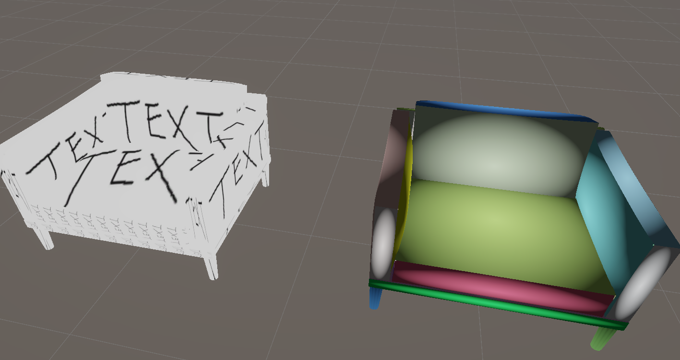
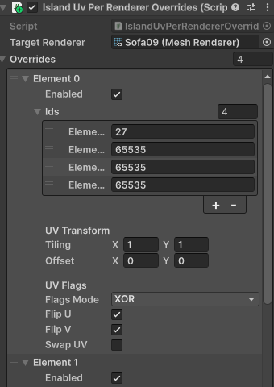
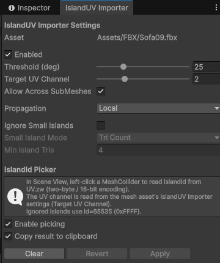

# IslandUV

IslandUV is a Unity **Editor** tool that generates per-island UVs at import time depending on threshold degree of mesh normals.

It also encodes a 16-bit `islandId` into the **same UV channel** (`uv.zw`), so shaders and tools can identify which island a fragment belongs to.





## Requirements

- Unity 6 (tested with `6000.4`, lower version maybe compatible.)

- Newtonsoft.JSON

## Install (UPM)

Install it via **Package Manager → Add package from git URL** from:

```text
https://github.com/curefate/IslandUV.git
```

Install Newtonsoft.Json from:

```text
com.unity.nuget.newtonsoft-json
```

## Usage (Importer)

1. Select a model asset (e.g. `.fbx`) in the Project window.
2. Open: **Tools → Island UV → Importer Settings**
3. Enable IslandUV and choose a **Target UV Channel** (0..7).
4. Click **Apply** to reimport.

### Output format

For the selected `Target UV Channel` the tool writes a `Vector4` UV:

- `uv.xy` = island UV (normalized to 0..1 within each island)
- `uv.zw` = `islandId` encoded as two bytes (little-endian): `z = lo / 255`, `w = hi / 255`. `0xFFFF` is reserved for ignored islands.

Ignored islands always write:

- `uv.xy = (0, 0)`
- `islandId = 0xFFFF`

## IslandId Picker

The Importer Settings window includes an optional Scene View picker:

- Click a `MeshCollider` to read `islandId` from `uv.zw`.
- The UV channel is taken from the mesh asset’s IslandUV importer settings.

## Shaders

Included URP shaders:

- `IslandUV/IslandUV_Unlit`
- `IslandUV/IslandUV_Debug`

Both shaders can decode `islandId` from `uv.zw` and allow selecting which UV channel to read via `_UvChannel`.

## Runtime

`IslandUvPerRendererOverrides` applies per-renderer overrides via `MaterialPropertyBlock` for the included unlit shader.

## License

[MIT](https://github.com/curefate/IslandUV/blob/main/LICENSE)
